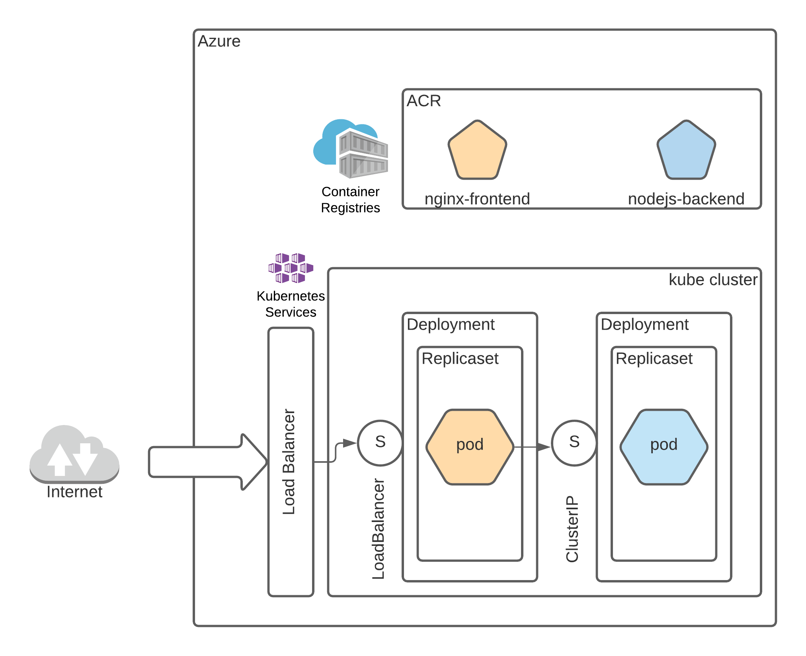

# Docker, Azure Container Registry and Azure Kubernetes Services

# Objectives of this tutorial are:

1. To setup Docker images for frontend NGINX proxy and a simple Node.js backend application
2. To push Docker images to Azure Container Registry [assumes you have setup one]
3. To use imperative semantics of Kubernetes [K8s] to deploy an application
4. To attempt to scale-up and scale down number of application instances deployed within the cluster

# Architecture



* Azure Load Balancer with external public IP assigned is Internet facing. Backend of Azure Load Balancer is the service connecting to the cluster
* Kube service of type 'LoadBalancer' establishes rules for the access (in this case a port 80 access)
* Node JS is used as the backend technology and NGINX proxy is the front end
* The hierarchy used below is - pod, replicaset and deployment

# Docker

## Backend: Pull, Change, Build and Push

Pull the image using the Dockerfile below. This is just a plain-vanilla Node.js image

### Pull: Dockerfile

Cut-and-paste following text into a `Dockerfile`. The actual pull will happen during `docker build`.

```
FROM node:10-alpine
RUN mkdir -p /home/node/app/node_modules && chown -R node:node /home/node/app
WORKDIR /home/node/app
COPY package*.json ./
USER node
RUN npm install
COPY --chown=node:node . .
EXPOSE 8080
CMD [ "node", "app.js" ]
```

### Change: package.js and app.js
Add app.js file added to the folder. Test if the app is working locally

1. Install required packages
```
npm install
```

2. Run locally

```
node app.js
```

3. Test
```
curl localhost:8080
My Hostname: xyz.local 
```
### Build: Image

If you are a Mac that is Apple Silicon based, although the build steps below succeed, it will **fail** when it is deployed on the cluster. Please follow instructions in this [link](https://blog.jaimyn.dev/how-to-build-multi-architecture-docker-images-on-an-m1-mac/) to build and deploy multi-architecture (x86/x64) images. Specifically, you might need to use an additional parameter `--platform linux/amd64` to deploy to ACI and AKS.

```
docker build . -t nodejs-backend
```

### Try running locally with docker
```
docker run --name nodejs-backend -p 8080:8080 -d nodejs-backend
```
Test it with a browser 'http://localhost:8080' this should show you the Docker instance hostname

### Push: To Azure Container Registry

Tag newly built image (tagging is necessary to push to ACR)
```
docker tag nodejs-backend <your ACR>.azurecr.io/nodejs-backend:v1
```

Check whether the tag and version is applied correctly
```
docker image ls                                      

REPOSITORY                                TAG       IMAGE ID       CREATED          SIZE
backend-nodejs                            latest    f3d40fee7064   14 minutes ago   113MB
<your ACR>.azurecr.io/backend-nodejs   v1        f3d40fee7064   14 minutes ago   113MB
```

Login to the repo
```
az acr login -n <your ACR>
The login server endpoint suffix '.azurecr.io' is automatically omitted.
Login Succeeded
```

Finally, push the image

```
docker push <your ACR>.azurecr.io/nodejs-backend:v1

The push refers to repository [<your ACR>.azurecr.io/nodejs-backend]
30ee6fdf1f50: Pushed
c2f5568d2d7d: Pushed
ceb29479d452: Pushed
5f70bf18a086: Pushed
deb5406e389b: Pushed
6f70d0d792c4: Pushed
1c4162a1ec66: Pushed
f428274dabf6: Pushed
f645bd8028b1: Pushed
v1: digest: sha256:75d5c6eb389a0df13290d1757089a182ed90106b1bc57cb118f28bc82d6afd66 size: 2198
```

If you just want to test this, use Azure Container Instances (ACI) and create a container. With the public IP you should be able to test the instance on ACI.

## Frontend: Pull, change, build and push
Frontend of our applications uses NGINX reverse proxy with a simple configuration file that redirects traffic to the backend.

### Pull: Dockerfile

Cut-and-paste following text into a `Dockerfile`. The actual pull will happen during `docker build`.

```
FROM nginx:latest
COPY default.conf /etc/nginx/conf.d
```

### Change: Default.conf

When we deploy this in the Kube cluster, we will need to adjust proxy_pass to the ClusterIP service of the backend

```
server {
    listen       80;
    server_name  localhost;
    location / {
    # Update your backend application Kubernetes Cluster-IP Service name  and port below      
    # proxy_pass http://<Backend-ClusterIp-Service-Name>:<Port>;      
    proxy_pass http://backend-service:8080;
    }
    error_page   500 502 503 504  /50x.html;
    location = /50x.html {
        root   /usr/share/nginx/html;
    }
}
```

### Build

```
docker build -t ngnix-frontend .
```

### Push: To Azure Container Registry

Tag newly built image (tagging is necessary to push to ACR)
```
docker tag ngnix-frontend <your ACR>.azurecr.io/ngnix-frontend:v1
```
Login to the repo
```
az acr login -n <your ACR>
The login server endpoint suffix '.azurecr.io' is automatically omitted.
Login Succeeded
```

Finally, push the image

```
docker push <your ACR>.azurecr.io/ngnix-frontend:v1
```

# Kubernetes (AKS)

In this example, we will use imperative semantics to deploy our Kubernetes Cluster. This means will only use kubectl commands to deploy our cluster and will NOT use YAML manifest to deploy our cluster. This section assumes that Azure Kubernetes Services is used to deploy the cluster. AKS makes use of CLI that needs to be installed as a pre-requisite using Azure CLI.

## Check whether Azure CLI is installed

### Windows 10
Launch a command window and issue following command

`az --version`

### Mac OS X

NOTE: Your build will NOT work when it is built on a Mac with M1 Chip.

Launch a Terminal window and issue following command

`az --version`

```
azure-cli                         2.23.0

core                              2.23.0
telemetry                          1.0.6

Python location '/opt/homebrew/Cellar/azure-cli/2.23.0/libexec/bin/python'
Extensions directory '/Users/narenvivek/.azure/cliextensions'

Python (Darwin) 3.8.10 (default, May  3 2021, 18:58:19)
[Clang 12.0.5 (clang-1205.0.22.9)]

Legal docs and information: aka.ms/AzureCliLegal


Your CLI is up-to-date.

Please let us know how we are doing: https://aka.ms/azureclihats
and let us know if you're interested in trying out our newest features: https://aka.ms/CLIUXstudy
```

## Install AKS CLI using Azure CLI
(you might need admin rights to perform this step. On Windows 10, you might need to launch a Cmd (Run as Administrator))

`sudo az aks install-cli`

## Login to the cluster
This is an important step to ensure we could perform ANY actions Control Plane actions on the cluster. If this step fails, your cluster access could be restricted to be a specific IP range or with additional authentication steps. Contact your Azure administrator if you are stuck. 

Also, this step expects that you have added a new AKS cluster (aks01) within an Azure Resoruce Group (aks-rg1).

`az aks get-credentials --admin --name aks01 --resource-group aks-rg1`

## Deploy the cluster

### Deploy the backend
Using the nodejs-backend image that you had uploaded in the previous section using `docker push` command, create a K8s Deployment. Please ensure that the correct version of the image is used (if you have anything different to v1).

```
kubectl create deployment my-backend-rest-app --image=<your ACR>.azurecr.io/nodejs-backend:v1
```

This will create the following:

1x Deployment
1x Replicaset
1x Pod

We will increase the pod count later.

`kubectl get all` gives me this:

```
kubectl get all
NAME                                      READY   STATUS    RESTARTS   AGE     
pod/my-backend-rest-app-8bc95d9b7-z2l7c   1/1     Running   0          8s      

NAME                 TYPE        CLUSTER-IP   EXTERNAL-IP   PORT(S)   AGE      
service/kubernetes   ClusterIP   10.0.0.1     <none>        443/TCP   126m     

NAME                                  READY   UP-TO-DATE   AVAILABLE   AGE     
deployment.apps/my-backend-rest-app   1/1     1            1           9s      

NAME                                            DESIRED   CURRENT   READY   AGE
replicaset.apps/my-backend-rest-app-8bc95d9b7   1         1         1       9s 
```
### Deploy the ClusterIP service connected to backend deployment
Kubernetes supports five service types:

1. ClusterIP for kubenet/CNI internal communication
2. LoadBalancer - external facing but only does L3/L4 traffic distribution
3. NodePort - Creates a port mapping on the underlying node that allows the application to be accessed directly with the node IP address and port.
4. ExternalName - Creates a specific DNS entry for easier application access
5. IngressController - external facing L7 loadbalancer with several L7 capabilities such as SSL termination etc.

Refer to  [AKS networking capabilities](https://docs.microsoft.com/en-us/azure/aks/concepts-network). We will use ClusterIP for the backend service (Node.js app) and LoadBalancer type for the frontend component (Nginx proxy).

Not using a `type` parameter in the command defaults to ClusterIP type.

Please observe the **bolded** text in the command. The name should be kept the same as our `default.conf` is hard-coded to access the service by its name.

`kubectl expose deployment my-backend-rest-app --port=8080 --target-port=8080 --name=`**`my-backend-service`**`

### Deploy frontend image to the cluster
Please ensure you are using the correct version of the image.

`kubectl create deployment my-frontend-nginx-app --image=<your ACR>.azurecr.io/ngnix-frontend:v1`

### Deploy the LoadBalancer type service

For this tutorial, we will just use the LoadBalancer type service.

`kubectl expose deployment my-frontend-nginx-app  --type=LoadBalancer --port=80 --target-port=80 --name=my-frontend-service`

### Verify successful deployment of the cluster

`kubectl get all -o wide`

```
NAME                                         READY   STATUS    RESTARTS   AGE   IP            NODE                                NOMINATED NODE   READINESS GATES
pod/my-backend-rest-app-8bc95d9b7-z2l7c      1/1     Running   0          54m   10.244.0.16   aks-agentpool-24920912-vmss000000   <none>           <none>pod/my-frontend-nginx-app-7dcbd5cb85-6gw4h   1/1     Running   0          36m   10.244.0.20   aks-agentpool-24920912-vmss000000   <none>           <none>
NAME                          TYPE           CLUSTER-IP    EXTERNAL-IP    PORT(S)        AGE   SELECTOR
service/kubernetes            ClusterIP      10.0.0.1      <none>         443/TCP        3h    <none>
service/my-backend-service    ClusterIP      10.0.0.66     <none>         8080/TCP       53m   app=my-backend-rest-app
service/my-frontend-service   LoadBalancer   10.0.63.102   20.65.28.210   80:30510/TCP   50m   app=my-frontend-nginx-app

NAME                                    READY   UP-TO-DATE   AVAILABLE   AGE   CONTAINERS       IMAGES                                       SELECTOR
deployment.apps/my-backend-rest-app     1/1     1            1           54m   nodejs-backend   <your ACR>.azurecr.io/nodejs-backend:v4   app=my-backend-rest-app
deployment.apps/my-frontend-nginx-app   1/1     1            1           36m   ngnix-frontend   <your ACR>.azurecr.io/ngnix-frontend:v6   app=my-frontend-nginx-app        

NAME                                               DESIRED   CURRENT   READY   AGE   CONTAINERS       IMAGES                                       SELECTOR
replicaset.apps/my-backend-rest-app-8bc95d9b7      1         1         1       54m   nodejs-backend   <your ACR>.azurecr.io/nodejs-backend:v4   app=my-backend-rest-app,pod-template-hash=8bc95d9b7
replicaset.apps/my-frontend-nginx-app-7dcbd5cb85   1         1         1       36m   ngnix-frontend   <your ACR>.azurecr.io/ngnix-frontend:v6   app=my-frontend-nginx-app,pod-template-hash=7dcbd5cb85
```
### Try accessing the service using `curl`

```
curl http://20.65.28.210
My Hostname: my-backend-rest-app-8bc95d9b7-z2l7c
```

## Scale-up the cluster
Spin-up 10 backend pods expanding the replicaset


`kubectl scale --replicas=10 deployment/my-backend-rest-app`
`deployment.apps/my-backend-rest-app scaled`

You should see this reflected in `kubectl get all`

```
NAME                                         READY   STATUS    RESTARTS   AGE
pod/my-backend-rest-app-8bc95d9b7-5cqlj      1/1     Running   0          59s
pod/my-backend-rest-app-8bc95d9b7-87gsn      1/1     Running   0          59s
pod/my-backend-rest-app-8bc95d9b7-94nl5      1/1     Running   0          59s
pod/my-backend-rest-app-8bc95d9b7-db29x      1/1     Running   0          59s
pod/my-backend-rest-app-8bc95d9b7-kb2gq      1/1     Running   0          59s
pod/my-backend-rest-app-8bc95d9b7-kq9sk      1/1     Running   0          59s
pod/my-backend-rest-app-8bc95d9b7-r9llj      1/1     Running   0          59s
pod/my-backend-rest-app-8bc95d9b7-wjdrj      1/1     Running   0          59s
pod/my-backend-rest-app-8bc95d9b7-z2l7c      1/1     Running   0          59m
pod/my-backend-rest-app-8bc95d9b7-zmgw5      1/1     Running   0          59s
pod/my-frontend-nginx-app-7dcbd5cb85-6gw4h   1/1     Running   0          41m
```

Now, curl the service again and you should see different hostnames (referring to different pods) that are servicing HTTP requests

```
curl http://20.65.28.210
My Hostname: my-backend-rest-app-8bc95d9b7-kq9sk

curl http://20.65.28.210
My Hostname: my-backend-rest-app-8bc95d9b7-87gsn
```

## Create cluster using YAML manifests
** Make sure the labels map correctly. You will spend considerable time debugging if you get it wrong. **

Please make sure `image` link is updated with correct Azure Container Registry link. You might just need to change `youracr` in `youracr.azurecr.io`

### Pod and Service
Either individual manifest files or just the directory could be suppled as the parameter for deployment. We shall use the directory name in all the examples below.

`kubectl apply -f kube-manifests-pod`

### Replicaset and Service

`kubectl apply -f kube-manifests-replicaset`

### Deployment and Service

`kubectl apply -f kube-manifests-deploy`

### Frontend - Backend full deployment

`kubectl apply -f kube-manifests-febe`

To change number of replica pods, change the deployment manifest and run the command again. Note that `kubectl apply` command is idompotent - it will only change the cluster if the manifest has any changes.
To test, use `curl <Load Balancer External IP address>` similar to previous steps.

## Clean-up

### Pod and Service

`kubectl delete -f kube-manifests-pod`

### Replicaset and Service

`kubectl delete -f kube-manifests-replicaset`

### Deployment and Service

`kubectl delete -f kube-manifests-deploy`

### Frontend - Backend full deployment

`kubectl delete -f kube-manifests-febe`

